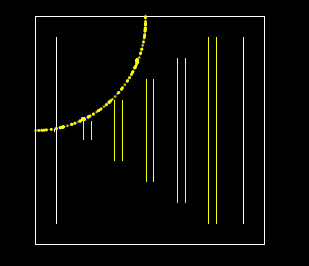
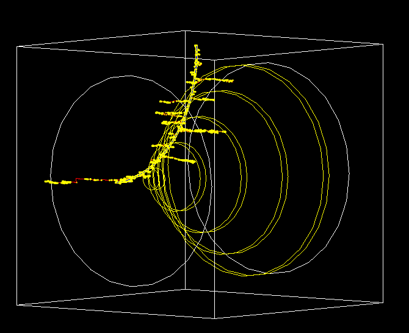
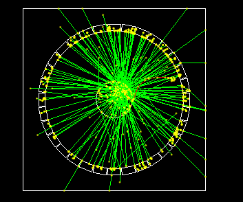

# Examples Geant4
Students:

Clara Lasaosa [clara.lasaosa@alumnos.ifca.es](clara.lasaosa@alumnos.ifca.es)

Laura Trujillo [lvtrujillot@unal.edu.co](lvtrujillot@unal.edu.co)

## Example B2:

_This example simulated a simplified fixed target experiment_

### B2a

List of parameters modified in the example:

Parameters | Values |
-----------|--------|
`globalField`| 2.0 T|
`gun/energy`| 1.0 GeV|
`gun/particle`| p |
`run/beamOn`| 1 (Fig. 1), 100 (Fig. 2) |

## Example B3

_This example simulates schematically a positron emitted tomography system_

### B3a

Parameters | Values |
-----------|--------|
`globalField`| 2.0 T|
`gun/energy`| 1.0 GeV|
`gun/particle`| e+ |
`run/beamOn`| 100 (Fig. 3) |

