---
title:
- Analysis of Top Quark
author:
- Laura Trujillo T
theme:
- Copenhagen
colortheme:
- beaver
date:
- 2020-03-30
header-includes:
 - \usepackage{fvextra}
 - \usepackage{relsize}
 - \DefineVerbatimEnvironment{Highlighting}{Verbatim}{breaklines,commandchars=\\\{\},fontsize=\tiny}

 - \definecolor{bgcolor}{HTML}{E0E0E0}
 - \let\oldtexttt\texttt
 - \newcommand{\code}[1]{\begingroup\setlength{\fboxsep}{1pt}\colorbox{bgcolor}{\oldtexttt{\hspace*{1pt}\vphantom{A}#1\hspace*{pt}}}\endgroup}
 - \renewcommand{\texttt}[1]{\code{\relscale{.7}\oldtexttt{#1}}}

---
# Goals

- Top-Antitop (ttbar) cross section measurement.
- Comparison of background and signal (MC): selections, purity and trigger efficiencies.
- Application to data

# Signal and Backgrounds

Signal: ttbar | Background: QCD |
:-------------:|------------------:|
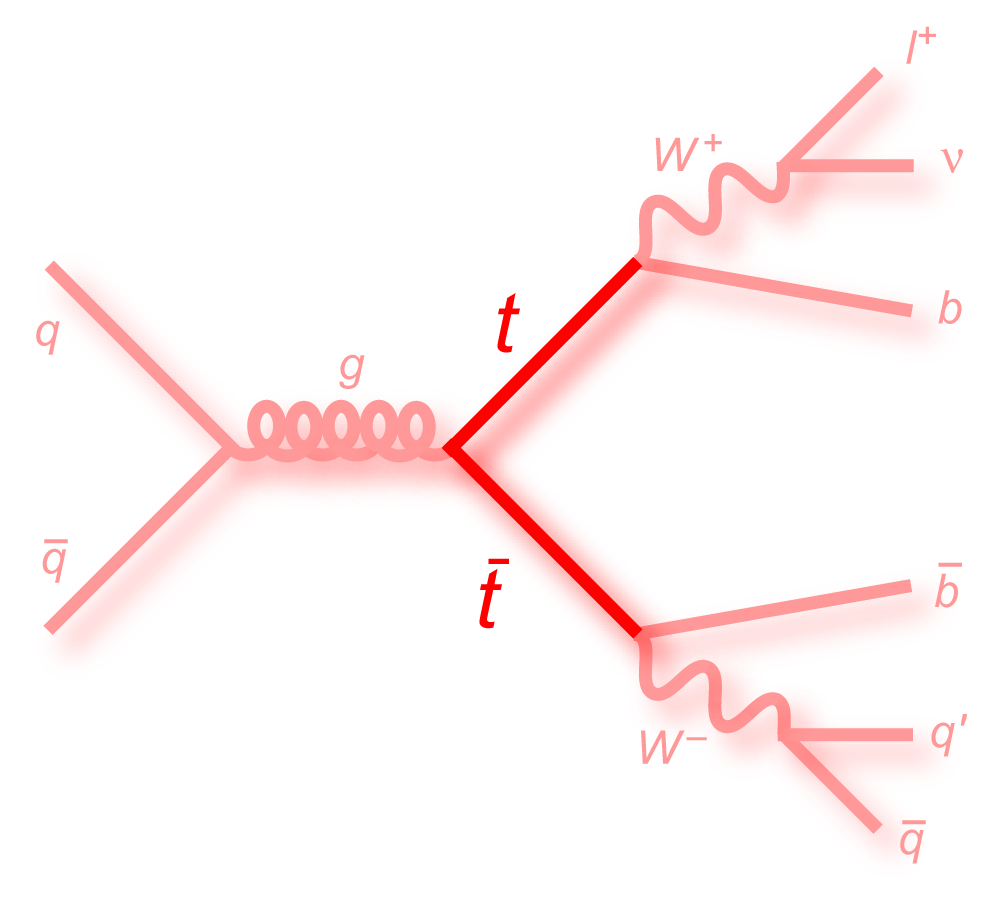{width=25%}	| 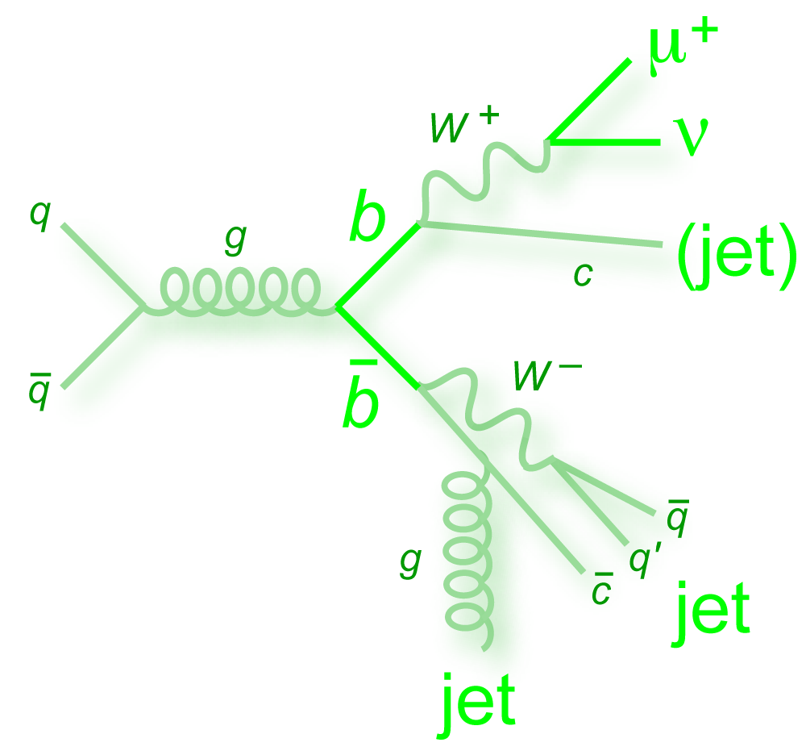{width=25%}|
Background: W+jets		| Background: Z+jets		|
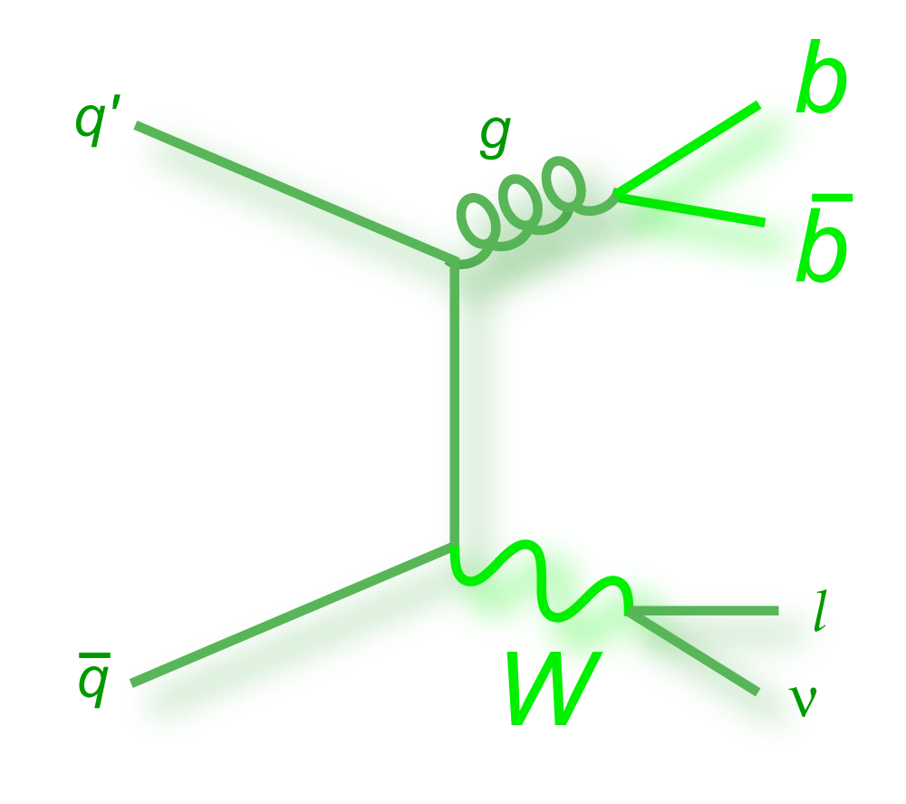{width=25%}	| 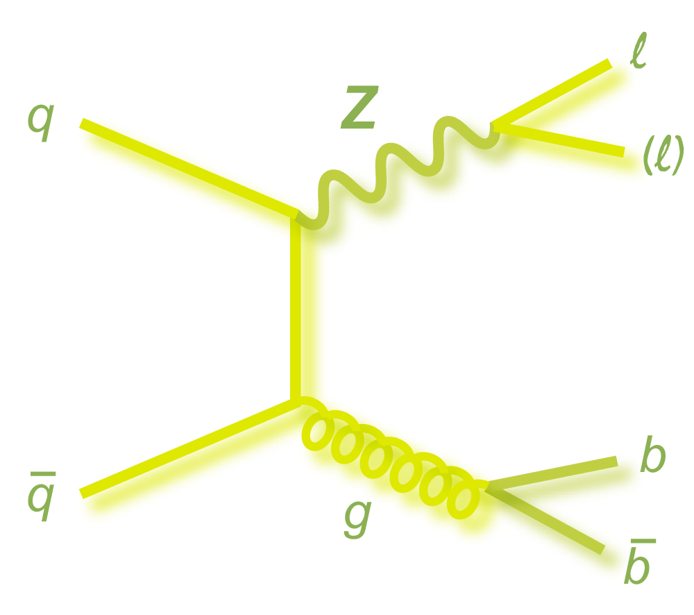{width=25%}|
Table: Images from [Useful Feynman Diagrams](http://www-d0.fnal.gov/Run2Physics/top/top_public_web_pages/top_feynman_diagrams.html)


# Invariant Di-Muon Mass {.fragile}

### Code block: _Exercise 1_ {.fragile}
<!-- Section 2.1 {.subsection} -->

```{.haskell}
int N_IsoMuon = 0, N_IsoTriggerMuon = 0;
MyMuon *muon1, *muon2;

for (vector<MyMuon>::iterator jt = Muons.begin();
	 jt != Muons.end(); ++jt){
   if (jt->IsIsolated(MuonReIsoCut)){
      ++N_IsoMuon;
      if (N_IsoMuon == 1) muon1 = &(*jt);
      if (N_IsoMuon == 2) muon2 = &(*jt);
   }

   if (jt->IsIsolated(MuonReIsoCut) && (triggerIsoMu24 == 1)){
      ++N_IsoTriggerMuon;
   }
}

  if (N_IsoMuon > 1 && triggerIsoMu24){
     if (muon1->Pt()>MuonPtCut){
        h_Mmumu->Fill((*muon1 + *muon2).M(), EventWeight);
     }
  }
```


# Results: Invariant Di-Muon Mass


Invariant Di-Muon Mass              	| Muon trigger selection
:------------------------------------:|:-------------------------:
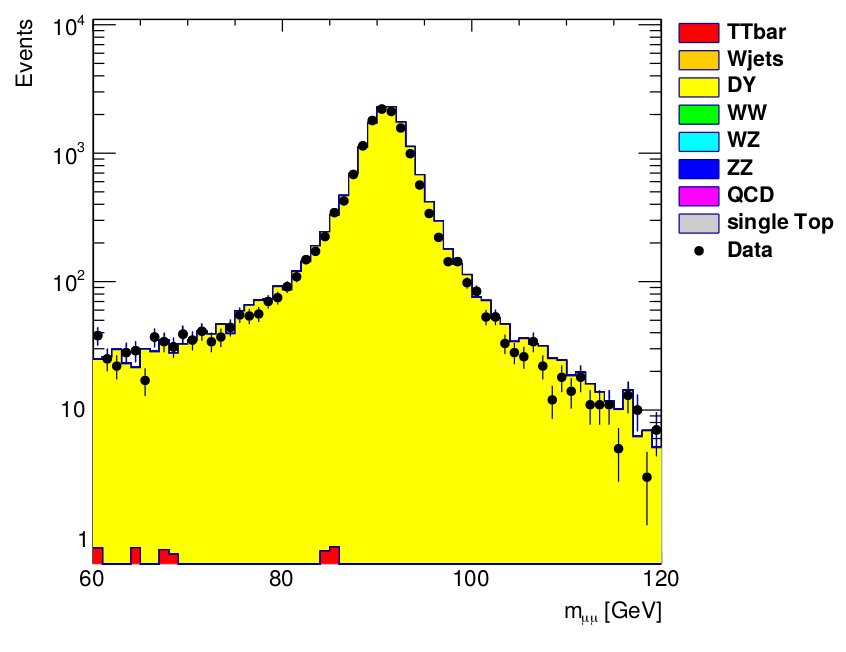{width=50%}  | 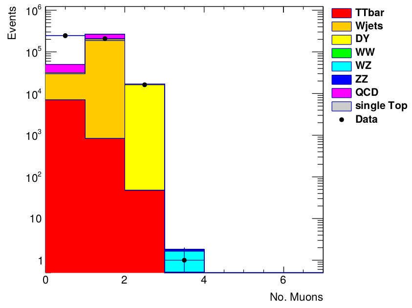{width=50%}

Table: Plots obtained for $m_{\mu \mu}$

# Results: Trigger efficiency

Trigger Eff pT              	| Trigger Eff Eta
:------------------------------------:|:-------------------------:
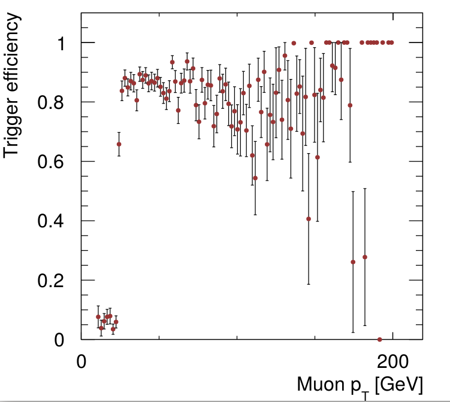{width=50%}  | 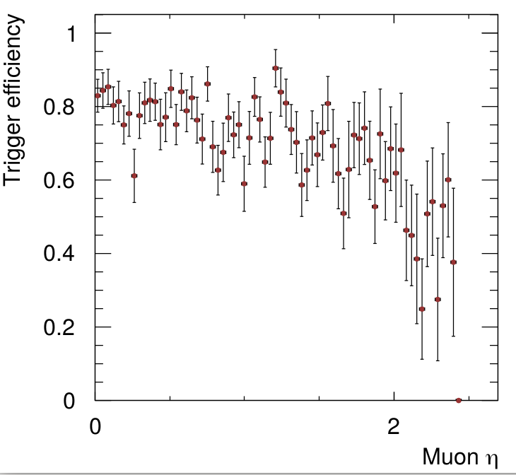{width=50%}

Table: Results from exercise 1

# Top Kinematics

### Code block: _Exercise 2_ {.fragile}
<!-- Section 4.1 {.subsection} -->

```{.haskell}
int N_Jets = 0, N_BJets = 0;
MyJet *jet1, *jet2, *jet3, *jet4, *bjet1, *bjet2;

if (N_IsoMuon > 0) {
	for (vector<MyJet>::iterator jt = Jets.begin(); jt != Jets.end(); ++jt){
++N_Jets;
		 if (jt->Pt()>30){ // Jets with pT > 30 GeV
			 if (N_Jets == 1) jet1 = &(*jt);
			 if (N_Jets == 2) jet2 = &(*jt);
			 if (N_Jets == 3) jet3 = &(*jt);
			 if (N_Jets == 4) jet4 = &(*jt);
		 }
		 if (jt->IsBTagged() == 1){
			 ++N_BJets;
			 if (N_BJets == 1) bjet1 = &(*jt);
			 if (N_BJets == 2) bjet2 = &(*jt);
		 }       
	}
 }
```

# Results: Jet multiplicity, MET and Pileup

Jet Multiplicity              	| B Jet Multiplicity
:------------------------------------:|:-------------------------:
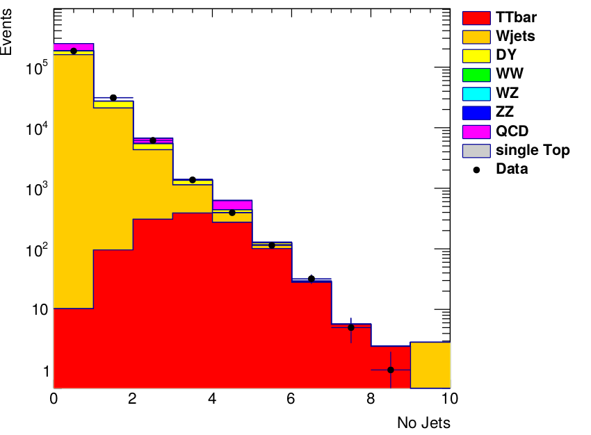{width=30%}  | 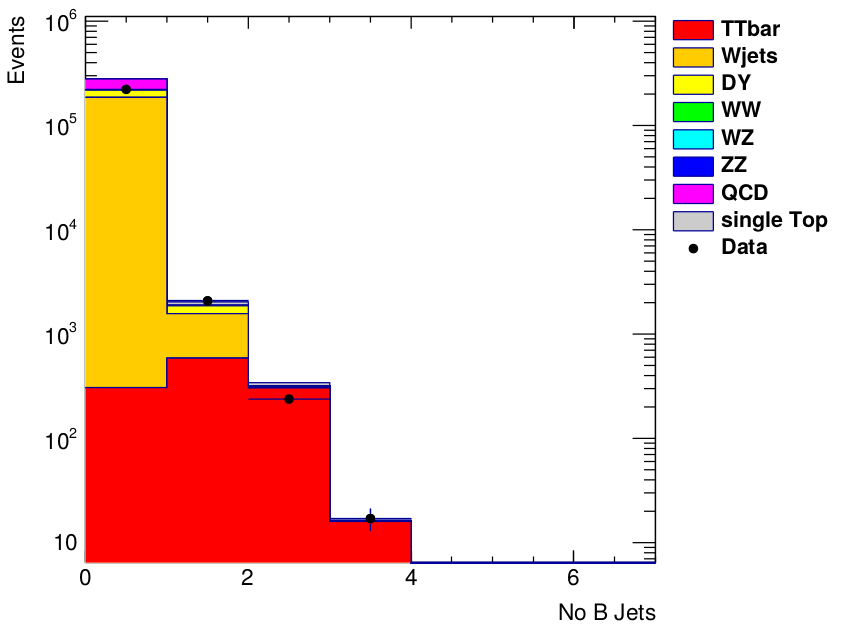{width=30%}
Missing Transverse Energy       | Pileup
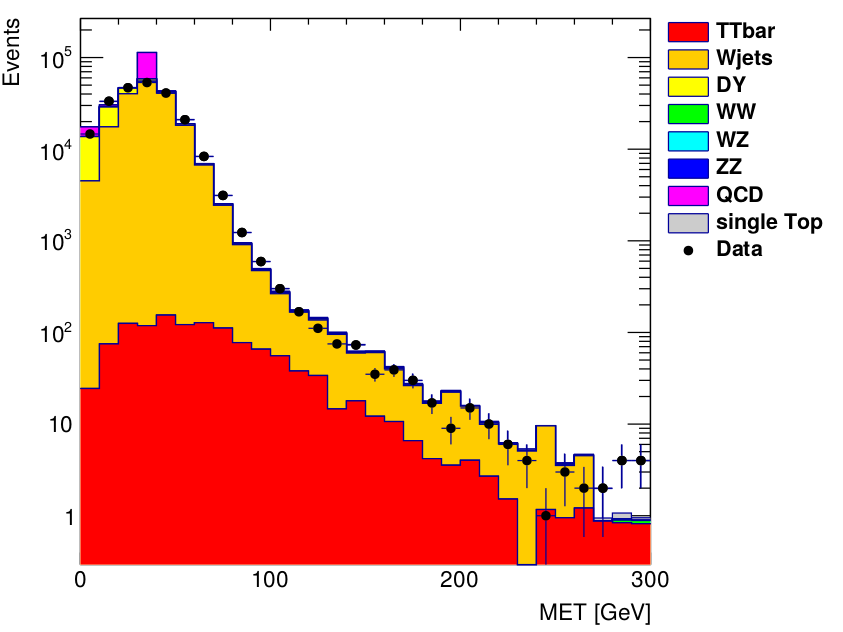{width=30%}  | 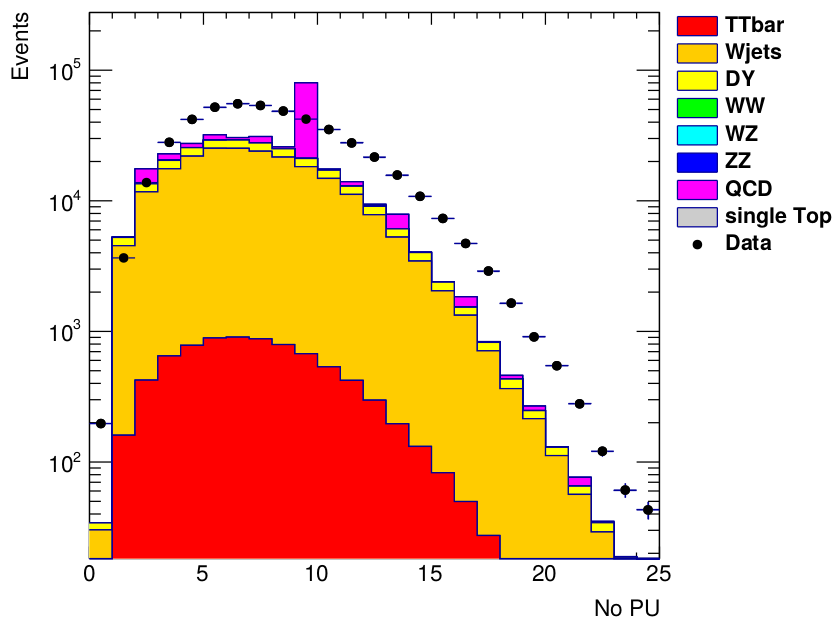{width=30%}
Table: Results from exercise 2


# Top kinematics
### Code block: _Exercise 2_ {.fragile}
<!-- Section 4.1 {.subsection} -->
```{.haskell}
if (N_Jets > 0 && triggerIsoMu24 == 1){
	 h_trigJet1_pt->Fill((*jet1).Pt(), EventWeight);
}
if (N_Jets > 1 && triggerIsoMu24 == 1){
	 h_trigJet2_pt->Fill((*jet2).Pt(), EventWeight);
}
if (N_Jets > 2 && triggerIsoMu24 == 1){
	 h_trigJet3_pt->Fill((*jet3).Pt(), EventWeight);
}
if (N_BJets > 0 && triggerIsoMu24 == 1){
	 h_trigBJet1_pt->Fill((*bjet1).Pt(), EventWeight);
}

```

# Results: Transverse momenta of jets

Jet 1             	| Jet 2
:------------------------------------:|:-------------------------:
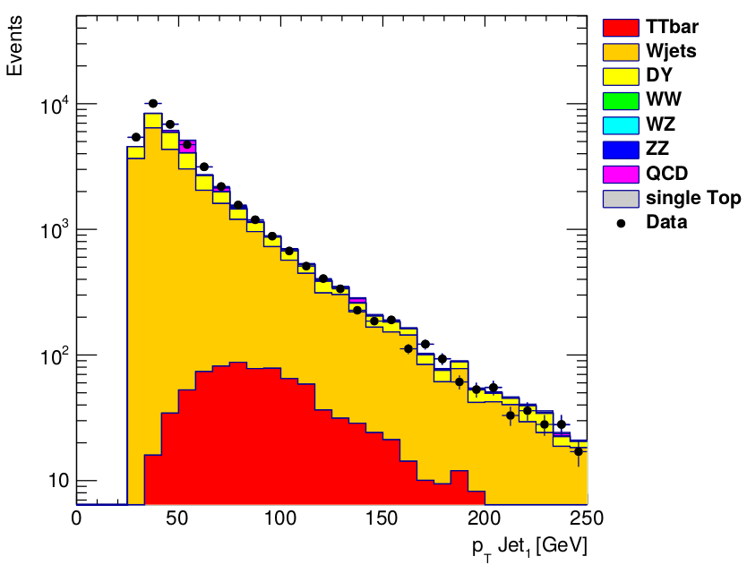{width=30%}  | 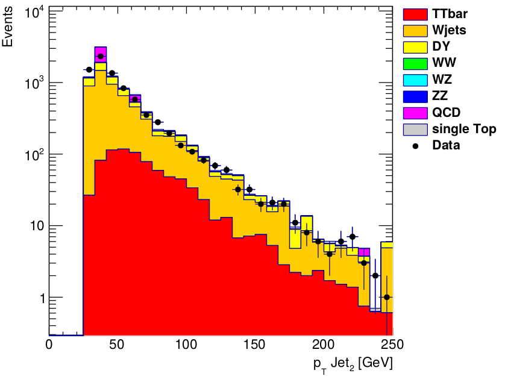{width=30%}
Jet 3                           | B-Jet 1
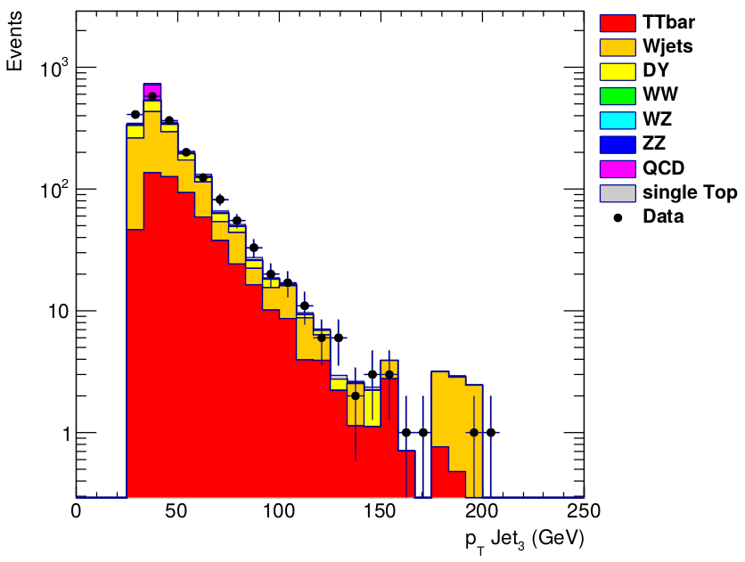{width=30%}  | 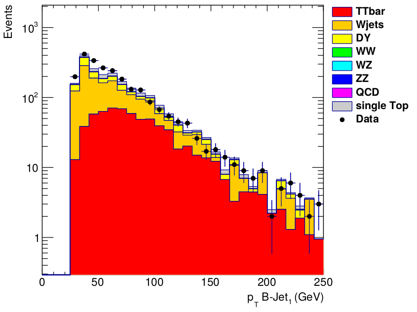{width=30%}
Table: Results from exercise 2

# Results: MET after cuts
### Code block: _Exercise 3_ {.fragile}
<!-- Section 4.1 {.subsection} -->

```{.haskell}
if (N_IsoMuon > 0 && triggerIsoMu24 == 1){
		if (N_Jets > 1 && N_BJets > 1){
  				h_NEvents_sel->Fill(1.0, EventWeight);
       			h_ttbar->Fill(met.Pt(), EventWeight);
		}
}
```

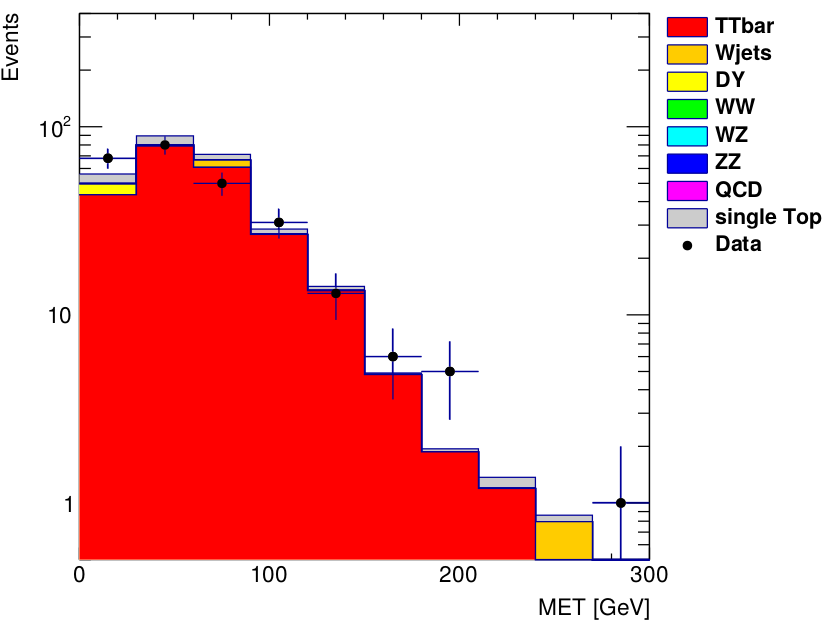{width=40%}


# Results: Acceptance, Purity and Efficiency

|              | ttbar   |   DY    | Total           |
|--------------+---------+---------+-----------------|
| NEvents_Sel  | 231.901 | 7.155   | 269.278         |
| NEvents_1l   | 1215.68 | 32314.6 | ---             |
| Data         | 255     | ---     | 224217          |
|$\colorbox{pink}{Purity}$   | ---     | ---     | \colorbox{pink}{94.69\% $\pm$ 5.30\%}    |
| $\colorbox{pink}{Acceptance}$       | ---     | ---     |  \colorbox{pink}{19\% $\pm$ 2\%}     |
| $\colorbox{pink}{Efficiency}$   | ---     | ---     |  \colorbox{pink}{0.029 $\pm$ 0.003}    |
| $\colorbox{red}{X-section}$    | ---     | ---     |  \colorbox{red}{149.38 $\pm$ 15.61} [pb]     |

<!-- section 5 {.subsection} -->
## Modified Cross Section Formula
$$ \sigma = \frac{N_{data} - N_{bkg}^{MC}}{L \times \epsilon \times BR}$$
