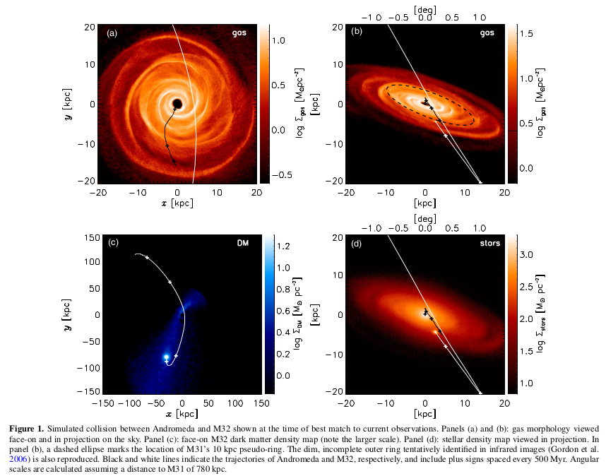
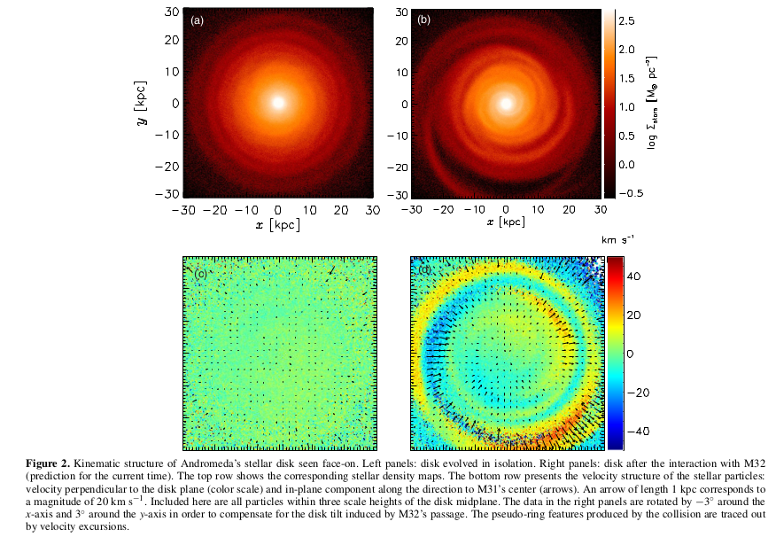
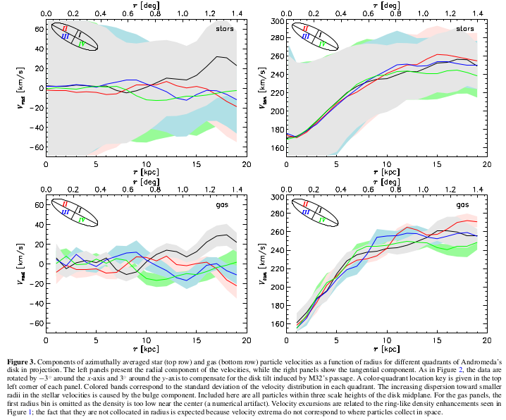

---
title:
- Signatures of M31-M32 Galactic Collision, _M. Dierickx et al_
author:
- Laura Trujillo T
theme:
- Copenhagen
colortheme:
- dolphin
---
# Introduction

+ Striking star-forming ring structure of Andromeda's Disk could result from bar
inestability or a **galactic collision**.
+ The origin of the compact morphology and high surface brightness of M32-like
galaxies is debated.
+ Hydrodynamic Simulations and Test Particle Modeling

# Results

# Results

# Results

# Summary / Conclusions

+ An offcenter collision with M32 explains the apparent pseudo-ring morphology
of Andromeda's disk.
+ Under this scenario, M32's passage occurred 800 Myr ago and produce measurable
velocity perturbation in Andromeda's disk.
+ The associated tidal stripping is **insufficient** to produce an M32-like
morphology, supporting an intrinsically compact origin for cEs.
