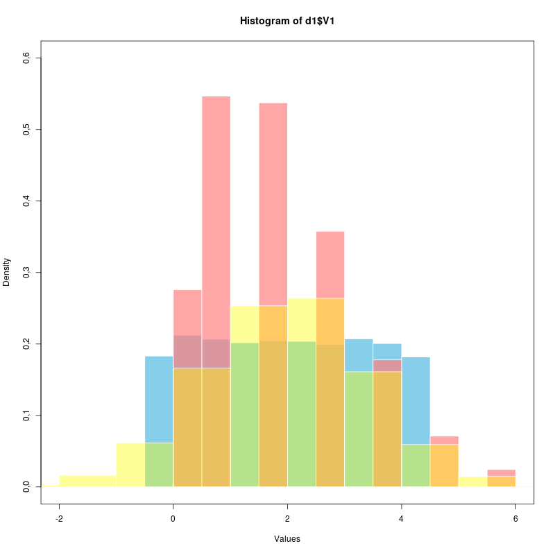
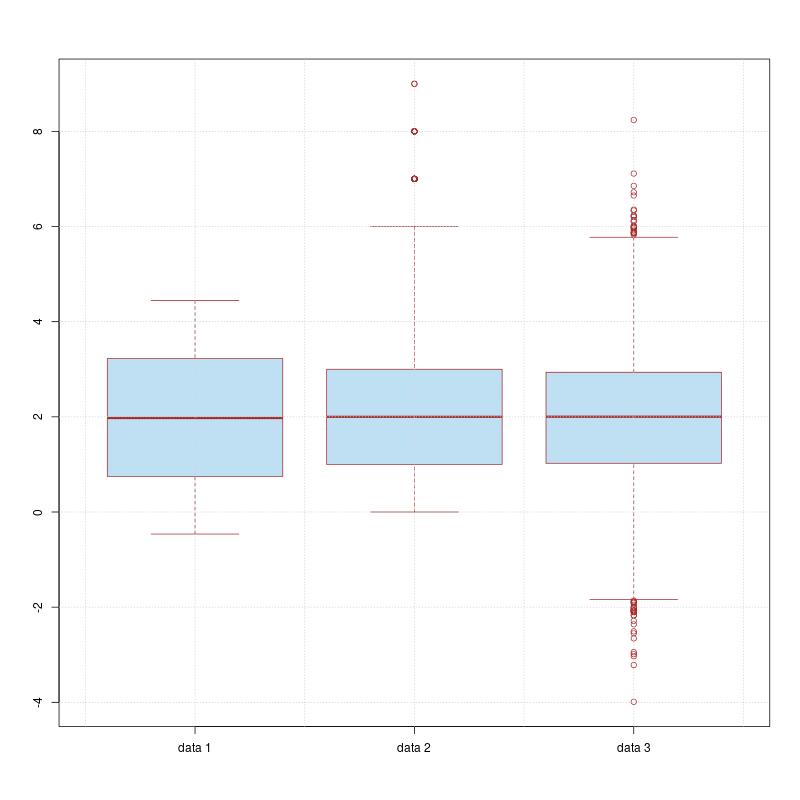

# <p align="center"> Statistics: Parametric and non-parametric hypothesis tests </p>
<p align="center">Laura V. Trujillo T </p>
<p align="center"> <a href="mailto: lvtrujillot@unal.edu.co">lvtrujillot@unal.edu.co </a> </p>
<p align="center"> November 18, 2019 </p>

## Abstract
This report provides a comparison between three distributions in order to analyze their differences and similarities with the implementation of parametric and non-parametric tests. This allows us to characterize the data sets given despite the fact their statistical parameters such as mean, median and standard deviation are alike.

## Introduction

In statistics one of the paradigms to analyze the data is called _tail-test_ or _p-value test_. It consists basically in making the data falls in a distribution probability on the basis of a "null hypothesis" and concluding whether this hypothesis is false or not so false. This allows us to characterize a data set by its mean and variance but also to establish the similarity or distinctiveness of two or more samples of data by statistical tests [2].

1. Student's t- Test

     This test is computed when two distributions could possibly have the same variance but different means and  It is useful for measuring the significance of the difference of means [2].


2. F-Test

    This test evaluates the hypothesis of two data sets having different variances by trying to reject the null hypothesis that they are actually consistent. It is based on a gaussian distribution.

    It is used to determine whether means of data sets are equal.


3. Z-Test

    It is implemented when the variance of the samples are known in order to determine whether their means are different and it is assumed to have a normal distribution. In other words, Z-test represents how many standard deviations above or below the mean of the sample score by the test is [3].

4. K-S Test

    It is implemented to compare distributions and it quantifies the distance between one or two distribution functions. Allows to detect patterns [3].


<div class="page-break"></div>

## Methodology

This section gives a brief overview on how it was tested three samples in order to compare their means, variances and distribution implementing several tests of statistical hypothesis in R [1].

**1.Comparison of Means**

Assuming the data as _normal distributed_, it was implemented to compare means the parametric `t.test`. Nevertheless, as the data does not behave as a normal distribution (see Figures), for a better comprehension it was also implemented the following non-parametric tests: `t.test` with ranks and `wilcox.test`.


**2.Comparison of Variances**

Similarly, it was performed the following parametric test in order to compare variances: `f.test` and `z.test`. In the non-parametric case, `f.test` on ranks was carried out (See Appendix).

**3.Comparison of Distributions**

It was used `ks.test` to compare if the data given follows the same distribution. The K-S test provides a comparison of the sample with a reference probability distribution in the case of one sample K-S test or compare two samples.

## Results

The statistical parameters for each data set was calculated using R [1] and it is given in the following table:

 Data | Mean |  Variance | Std Dev |
---|--- | --- | --- | --- | ---| --- |
`dat1`| 1.9863 |  2.0015 | 1.4147 |
`dat2`|1.9863 |  2.0015 | 1.4147 |
`dat3`| 1.9863 |  2.0015 | 1.4147 |
<p align="center"> <i>Table 1. Statistical parameters for each data set </i> </p>

For better appreciation of the data sets, see Figure 1 and Figure 2.

<p align="center">    </p>
<p align="center"> <i> Figure 1. Histograms of data 1, data 2 and data 3 </i> </p>


<p align="center">    </p>
<p align="center"> <i> Figure 2. Boxplot of data 1, data 2 and data 3 </i> </p>

\
<div class="page-break"></div>

**1.Comparison of Means**

The results obtained for each tests are summarized  in Table 2.

   Test | `data1, data2`  |`data2, data3`| `data1, data3` |
---|--- | --- | --- | --- | ---| --- |
`t.test`|`p.value:`1.00<br>`2pt:`1.00<br>| `p.value:`1.00<br>`2pt:`1.00<br>| `p.value:`1.00<br>`2pt:`1.00<br> |
Ranked `t.test`|`p.value:`0.009| `p.value:`2.948e-5 | `p.value:`0.861|
`wilcox.test`| `p.value:`0.009 | `p.value:`2.958e-5 |`p.value:`0.861|
<p align="center"> <i>Table 2. Tests for comparing means </i> </p>

As observed in table above (Table 2) for the parametric _t test_ case, the _p-value_ obtained  suggests that the null hypothesis should not be rejected. Nevertheless, as shown in Figure 1 the two first samples do not follow a normal distribution and hence, it is wiser to take into account _non-parametric_ tests.

As expected, both _Wilcoxon_ and ranked _t test_ give similar results for _p value_. For _data1-data2_ and _data2-data3_, the _p value_ obtained indicates that the null hypothesis can be rejected since it is less than 0.05 (value commonly used in the industry to reject hypothesis). However, from Table 1 it is clear that the mean for the samples is almost (if not) identical but both tests are comparing the mean of the _ranks_ of the data sets and therefore, the results obtained are telling us that in fact there is a statistical difference between the means of the samples. On the other hand, for _data1-data3_ it is showed that the null hypothesis should not be rejected.


**2.Comparison of Variances**

Test | `data1, data2`  |`data2, data3`| `data1, data3` |
---|--- | --- | --- | --- | ---| --- |
`f.test`|`p.value:`1.00<br>`2pf:`1.00<br>| `p.value:`1.00<br>`2pf:`1.00<br>| `p.value:`1.00<br>`2pf:`1.00<br> |
Ranked `f.test`|`p.value:`0.00| `p.value:`1.696e-2 | `p.value:`1.820e-14|
`z.test`| `p.value:`1.00 | `p.value:`1.00 |`p.value:`1.00|
`Z expr`| `p.value:`0.999 | `p.value:`0.999 |`p.value:`0.999|
<p align="center"> <i>Table 3. Several tests for comparing variances </i> </p>

Both parametric _f_ and _z_ tests return a p value equals to 1, meaning that the null hypothesis in which the means of the data compared are equal should no be rejected. On the contrary, for non parametric ranked _f test_ the _p value_ indicates that there is actually statistical differences in the variance of the samples.


<div class="page-break"></div>

**3.Comparison of Distributions**

Test | `data1, data2`  |`data2, data3`| `data1, data3` |
---|--- | --- | --- | --- | ---| --- |
`ks.test`|`p.value:`0.00<br>`D:`0.176<br>| `p.value:`0.00<br>`D:`0.18<br>| `p.value:`1.11e-16<br>`D:`0.061<br> |
<p align="center"> <i>Table 4. K-S test for comparing distributions </i> </p>

The _p-value_ < 0.05 shows that there exists a statistical distinction between the data sets as expected (see Figure 1)

## Conclusions

As an overall conclusion the hypothesis tests allow to check and evaluate whether samples (simulated or empirical data) have similar or common statistical parameters or behavior. Nonetheless, as shown in this report it is important before hand plotting histograms of data in order to choose wisely the parametric or non parametric test. The _p-values_ change radically when using parametric instead of non-parametric as shown in Table 1 and Table 2 and it could affect statistical conclusions and misleading what the data is actually telling.


# Appendix: Coding Section


```R
#Resizing plots
library(repr)
library(BSDA)
library(pracma)
options(repr.plot.width=5, repr.plot.height=5)
```


```R
# Data uploading
d1 <- read.table("dat1.dat", header=FALSE)
d2 <- read.table("dat2.dat", header=FALSE)
d3 <- read.table("dat3.dat", header=FALSE)
```

#### Do they have the same mean?
**Parametric test**
1. `t.test`


```R
t1 <- t.test(d1$V1, d2$V1, mu=0, paired=FALSE, conf.level=0.95)
t2 <- t.test(d2$V1, d3$V1, mu=0, paired=FALSE, conf.level=0.95)
t3 <- t.test(d1$V1, d3$V1, mu=0, paired=FALSE, conf.level=0.95)

p1 <- 2 * pt(t1$statistic, df = 19998)
p2 <-  2 * pt(t2$statistic, df = 19998)
p3 <-  2 * pt(t3$statistic, df = 19998)

rbind(t12 = t1$p.value, t23 = t2$p.value, t13 = t3$p.value, pt1 = p1, pt2 =p2, pt3=p3)
```


**Non-parametric test of the mean**
1. Ranked`t.test`  & `wilcox.test`


```R
#Two samples Data 1 and Data 2
x <- d1$V1
y <- d2$V1

# Ranks
rank12 <- rank(c(x, y), ties.method="average") # Creating rank of data samples 1 & 2
ranked_x <- rank12[1:length(x)] # rank Ra
ranked_y <- rank12[-(1:length(x))] #The other rank Rb
#ranked_y <- rank12[(length(x) + 1):length(y)]

#t-test with ranks
ttest12 <- t.test(ranked_x, ranked_y, mu=0)

# Wilcoxon test
wilcox12 <- wilcox.test(x, y, mu=0)

#Showing p-values for both test
rbind(wilcoxon = wilcox12$p.value, ttest = ttest12$p.value) # rbind combine r objects by rows
```


<table>
<tbody>
	<tr><th scope=row>wilcoxon</th><td>0.009026857</td></tr>
	<tr><th scope=row>ttest</th><td>0.009023614</td></tr>
</tbody>
</table>


```R
# Two samples Data 2 and Data 3 (Poisson distribution and Gaussian distribution)
x <- d2$V1
y <- d3$V1

#parametric t-test
ttest23 <- t.test(x, y, mu=0)

# non-parametric t-test
dat23 <- c(d2$V1, d3$V1)
rank23 <- rank(dat23, ties.method="average")
ranked_x <- rank23[1:length(x)]
ranked_y <- rank23[- (1:length(x))]

nttest23 = t.test(ranked_x, ranked_y, mu = 0)
#Wilcoxon test
wilcox23 <- wilcox.test(x, y, mu=0)
#p-values are:
rbind(wilcoxon=wilcox23$p.value, par.ttest=ttest23$p.value, non.par.ttest = nttest23$p.value)
```


<table>
<tbody>
	<tr><th scope=row>wilcoxon</th><td>2.958651e-05</td></tr>
	<tr><th scope=row>par.ttest</th><td>1.000000e+00</td></tr>
	<tr><th scope=row>non.par.ttest</th><td>2.948848e-05</td></tr>
</tbody>
</table>


```R
#Two samples Data1 & Data 3
x <- d1$V1
y <- d3$V1

#Ranked t.test
dat13 <- c(d1$V1, d3$V1)
rank13 <- rank(dat13, ties.method="average")
ranked_x <- rank13[1:length(x)]
ranked_y <- rank13[-(1:length(x))]

ttest13 <- t.test(ranked_x, ranked_y, mu=0)

#Wilcoxon test
wilcox13 <- wilcox.test(x,y, mu=0)

#p-values are:
rbind(wilcoxon=wilcox13$p.value, ttest=ttest13$p.value)
```


<table>
<tbody>
	<tr><th scope=row>wilcoxon</th><td>0.8614699</td></tr>
	<tr><th scope=row>ttest</th><td>0.8614740</td></tr>
</tbody>
</table>


```R
#Some test to figure out what a rank is.

dat12 <- c(d1$V1[0:3], d2$V1[0:3])
#dat12 =  2.7, 1.7, 0.6, 2, 4, 3
r1 <- rank(dat12, ties.method="average")
# 2, 1.7, 2.7, 0.6, 3, 4
#sort 3, 2, 4, 1, 6, 5 (ascending)
# rank 4, 2, 1, 3, 6, 5
rx <- r1[1:length(d1$V1[0:3])] #4, 2, 1
ry <- r1[- (1:length(d1$V1[0:3]))] # 3, 6, 5
#t.test(rx, ry)
```

#### Do they have the same variance?

**Parametric test**
1. `F-test`


```R
# F-test data1, data2 & data3 --- Assuming normal distribution
a <- d1$V1
b <- d2$V1
c <- d3$V1

ftest12 <- var.test(a, b)
ftest23 <- var.test(b, c)
ftest13 <- var.test(a, c)

nu1=length(d1$V1) - 1
nu2=length(d2$V1) - 1
nu3 = length(d3$V1) - 1

F12 = 2 * pf(ftest12$statistic, nu1, nu2)
F23 = 2 * pf(ftest23$statistic, nu2, nu3)
F13 = 2 * pf(ftest13$statistic, nu1, nu3)

#F-values
rbind(F1=F12, F2=F23, F3=F13)
#p-values
rbind(ftest1=ftest12$p.value, ftest2=ftest23$p.value,ftest3=ftest13$p.value)
```


<table>
<thead><tr><th></th><th scope=col>F</th></tr></thead>
<tbody>
	<tr><th scope=row>F1</th><td>1</td></tr>
	<tr><th scope=row>F2</th><td>1</td></tr>
	<tr><th scope=row>F3</th><td>1</td></tr>
</tbody>
</table>


<table>
<tbody>
	<tr><th scope=row>ftest1</th><td>1</td></tr>
	<tr><th scope=row>ftest2</th><td>1</td></tr>
	<tr><th scope=row>ftest3</th><td>1</td></tr>
</tbody>
</table>


2. `z.test`


```R
ztest12 <- z.test(a, b, sigma.x=sd(a), sigma.y=sd(b))
ztest23 <- z.test(b, c, sigma.x=sd(b), sigma.y=sd(c))
ztest13 <- z.test(a, c, sigma.x=sd(a), sigma.y=sd(c))

# p -values
rbind(ztest1=ztest12$p.value, ztest2=ztest23$p.value, ztest3=ztest13$p.value)

#Z from expression
ma <- mean(a)
mb <- mean(b)
mc <- mean(c)

sa <- sd(a) ** 2 / length(a)
sb <- sd(b) ** 2 / length(b)
sc <- sd(c) ** 2 / length(c)

Z12 = (ma - mb) / sqrt(sa + sb)
Z23 = (mb - mc) / sqrt(sb + sc)
Z13 = (ma - mc) / sqrt(sa + sc)

rbind(Z1.pvalue=erfc(Z12), Z2.pvalue=erfc(Z23), Z3.pvalue=erfc(Z13) )
```


<table>
<tbody>
	<tr><th scope=row>ztest1</th><td>1</td></tr>
	<tr><th scope=row>ztest2</th><td>1</td></tr>
	<tr><th scope=row>ztest3</th><td>1</td></tr>
</tbody>
</table>


<table>
<tbody>
	<tr><th scope=row>Z1.pvalue</th><td>1</td></tr>
	<tr><th scope=row>Z2.pvalue</th><td>1</td></tr>
	<tr><th scope=row>Z3.pvalue</th><td>1</td></tr>
</tbody>
</table>


**Non parametric** `f.test`


```R
#----------   Ranks -------------
# Length data1 is equal for all data sets !
## Data 1 & Data 2
dat12 <- c(d1$V1, d2$V1)
rank12 <- rank(dat12, ties.method="average")
r1_x <- rank12[1:length(a)]
r1_y <- rank12[-(1:length(a))]

## Data 2 & Data 3
dat23 <- c(d2$V1, d3$V1)
rank23 <- rank(dat23, ties.method="average")
r2_x <- rank23[1:length(a)]
r2_y <- rank23[-(1:length(a))]

## Data 1 & Data 3
## Data 1 & Data 2
dat13<- c(d1$V1, d3$V1)
rank13 <- rank(dat13, ties.method="average")
r3_x <- rank13[1:length(a)]
r3_y <- rank13[-(1:length(a))]

#var.test
nftest12 = var.test(r1_x, r1_y)
nftest23 = var.test(r2_x, r2_y)
nftest13 = var.test(r3_x, r3_y)

rbind(non.ftest1 = nftest12$p.value, non.ftest2 = nftest23$p.value, non.ftest3 = nftest13$p.value)
```


<table>
<tbody>
	<tr><th scope=row>non.ftest1</th><td>0.000000e+00</td></tr>
	<tr><th scope=row>non.ftest2</th><td>1.695990e-02</td></tr>
	<tr><th scope=row>non.ftest3</th><td>1.820766e-14</td></tr>
</tbody>
</table>


#### Are they compatible with being the same distribution?

1. `K-S test`


```R
# Data 1 & Data2
ks12 <- ks.test(d1$V1, d2$V1)

# Data 2 & Data 3
ks23 <- ks.test(d2$V1, d3$V1)

# Data 1 & Data 3
ks13 <- ks.test(d1$V1, d3$V1)
```

    Warning message in ks.test(d1$V1, d2$V1):
    “p-value will be approximate in the presence of ties”Warning message in ks.test(d2$V1, d3$V1):
    “p-value will be approximate in the presence of ties”Warning message in ks.test(d1$V1, d3$V1):
    “p-value will be approximate in the presence of ties”

It seems like the warning is due to the implementation in R of `ks.test` expecting a continuous distribution. Nonetheles, K-S test works with both discrete and continuous. (This is just a _guess_)


```R
rbind(K.S1 = ks12$p.value, K.S2=ks23$p.value, K.S3=ks13$p.value)
rbind(D1= ks12$statistic, D2=ks23$statistic, D3=ks13$statistic)
```


<table>
<tbody>
	<tr><th scope=row>K.S1</th><td>0,000000e+00</td></tr>
	<tr><th scope=row>K.S2</th><td>0,000000e+00</td></tr>
	<tr><th scope=row>K.S3</th><td>1,110223e-16</td></tr>
</tbody>
</table>


<table>
<thead><tr><th></th><th scope=col>D</th></tr></thead>
<tbody>
	<tr><th scope=row>D1</th><td>0,1763</td></tr>
	<tr><th scope=row>D2</th><td>0,1804</td></tr>
	<tr><th scope=row>D3</th><td>0,0617</td></tr>
</tbody>
</table>


#### Plots


```R
png("boxplot.png", width=800, height=800)
boxplot(d1$V1, d2$V1, d3$V1, names=c("data 1","data 2","data 3"), col=rgb(0 , 0.5 , 0.8,alpha=0.25), border="brown")
grid()
dev.off()
```


<strong>png:</strong> 2


### `data1`


```R
png("histd1.png", width=800, height=800)
hist(d1$V1, freq=FALSE, main="Data 1",ylim=c(0, 0.25), col=rgb(0 , 0.5 , 0.8,alpha=0.25),
     border="black",breaks = 10, xlab="V1",
     xlim=c(-1,5))
curve(dunif(x, min=min(d1$V1), max=max(d1$V1)), from=-1, to=5, add=T, col="red", lw=2)
dev.off()
```


<strong>png:</strong> 2


### `data2`


```R
curpois <- dpois(x = 0:max(d2$V1), lambda = 1.5)

hist(d2$V1, freq=FALSE, prob=TRUE, xlim=c(0, 8.0), ylim=c(0, 0.4), col=rgb(0 , 0.5 , 0.8,alpha=0.25), xlab="V1",
    breaks=rep(0:10,each=2.5)+c(-.3,.3))
points(0:max(d2$V1), curpois, pch=16, col=2)
#curve(dnorm(x, mean = 2, sd = sqrt(2)),add = TRUE, col = 'red')
```


### `data3`


```R
png("histd3.png", width=800, height=800)
hist(d3$V1, freq=FALSE,main="Data 3", ylim=c(0, 0.35),col=rgb(0 , 0.5 , 0.8,alpha=0.25), xlab="V1")
curve(dnorm(x, mean=mean(d3$V1), sd=sd(d3$V1)), from=-4, to=8, add=T, col="red", lw=2)
dev.off()
```

<strong>png:</strong> 2


## Bibliography
[1] R Core Team (2019). R: A language and environment for statistical
  computing. R Foundation for Statistical Computing, Vienna, Austria.
  URL https://www.R-project.org/.

[2] Press W, Teukolsky S, Vetterling W, and Flannery. 1992. Numerical Recipes in C (2nd Ed.): The Art of Scientific Computing. Cambridge University Press, New York, NY, USA.


[3]     Hines, William W (2003). Probability and statistics in engineering (4th ed). John Wiley, New York
