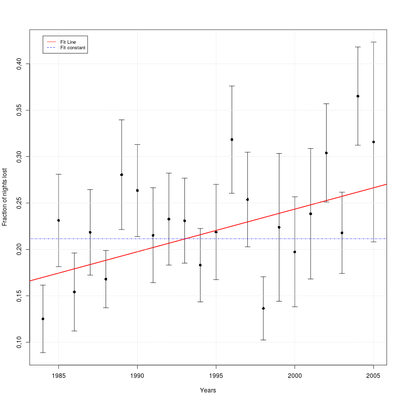
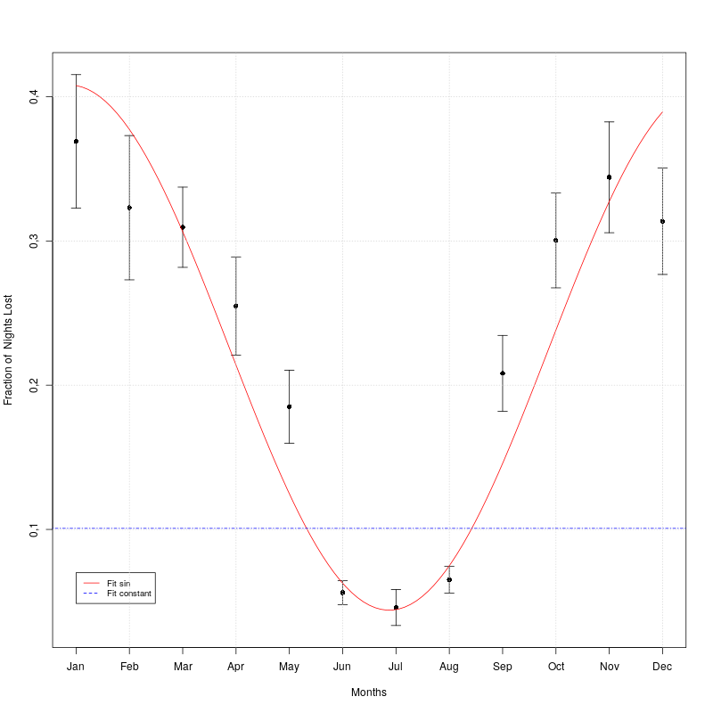
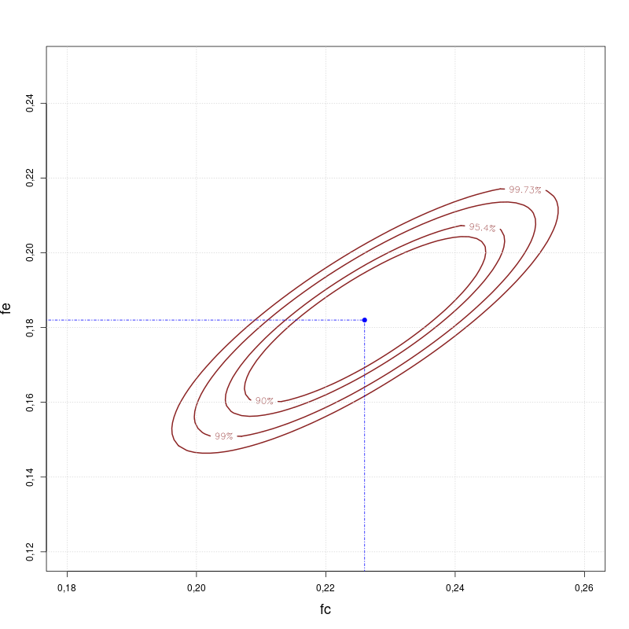

# <p align="center"> Statistical Modelling of Data </p>
<p align="center">Laura V. Trujillo T </p>
<p align="center"> <a href="mailto: lvtrujillot@unal.edu.co">lvtrujillot@unal.edu.co </a> </p>
<p align="center"> December 10th, 2019 </p>

## Abstract
The desire of this report is to provide an estimation on the goodness of a fit for the fraction of nights lost due to bad weather in an astronomical observatory per month and per year. In this regard, the _chi-square statistic_ was used in order to determine how good a model is compare to the observations given and the _F-statistic_ to make an estimate of the improvement of a model over another. It was found for the nights lost per month that the assumption for no seasonal variation is not accurate and for the nights lost per year that the improvement from a linear model over a constant one is minimal.

## Introduction

Given a set of measurements it is convenient to summarize the data by fitting it using a model that allows the adjustment of parameters [2]. Typically, when comparing data and models it is used the _hypothesis testing_ and _the parameter estimation_ which describe how probable it is that the observations taken have been obtained if the theory or model is correct and how good the fitting parameters are determined with its error [5].

1. **Chi-square statistic**

    It is used to find out how good the model is compare to the data or the observations [2]. The probability of the Chi-square distribution gives a quantitive measure for the goodness of fit for a model [4]

2. **Goodness of a fit**

    It is based on the sum of variances of independent gaussian variables [2] and it gives information on the probability that the data come from a model with the fitted parameters [4, 5].


## Methodology

This section gives a brief overview on how it was obtained the fitting for the fraction of nights lost per year and month in an observatory using R [1].

1. **Fraction of nights lost per year**

   Given a set of data with nights lost each month during 1984 til 2005, it was computed the fraction of nights lost dividing for the total days in each month (and also taking into account leap years). Two basic models were developed to compare how good it represented the data obtained which were the model assuming it was a constant and the other one assuming it behaves as a linear function.

   Then, since the second model is an extension of the first one, it was compared with the _F-test_ the improvement of the linear model over the constant one.

1. **Fraction of nights lost per month**

    Similarly, the data is compared by two models: the constant one and the sinusoidal function called `flost`. For both models, it was determined the fitting parameters and the value of the chi-square in order to compare them. Also the confidence interval for the fitting parametes of `flost` were derived from the hessian matrices [6].

## Results

1. **Fraction of nights lost per year**

    The fitting parameters for model 1 (fit a constant) and model 2 (fit a line) are given in _Table 1_. The chi-square obtained shows a greater value for model 1 than for model 2 and as shown in _Figure 1_ it seems like model 2 describes in a better way the data obtained than model 1.


Fit | Parameters |Chi-square| Confidence interval|
---|--- | --- | --- | --- | --- |
Constant | `ao`= 0.2115 | 34.652 | `90%` <br>(0.1948,0.2282)
Line  | `ao` = -8.946 <br> `bo`= 0.00459 | 26.842 | `99%`<br>(0.00036, 0.00882) <br> `90%` (0.00188, 0.00730)|
<p align="center"> <i>Table 2. Values for fit of a constant and line </i> </p>

<p align="center">    </p>
<p align="center"> <i> Figure 1. Fraction of night lost per year with fitted curves </i> </p>

  Nevertheless, in order to compare in a proper way this comparison, _F-statistic_ was computed and its result is given in _Table 3_.

Model |F | P | Q |
--- | --- | --- | ---|
1. Constant| -- |  0.969 | 0.0308|
2. Line | -- |0.860 | 0.139|
3. Comparison | 5.818 |  0.999 | 0.0001|
<p align="center"> <i>Table 3. Comparison between constant and linear models </i> </p>


  The goodness-of-fit `Q` shows that adding new parameters to the model (`a,b`) results in lower values for chi-square and therefore one might think the linear model could improve greatly the fit. Notwithstanding, as shown in _Table 3_, although there is an improvement it is quite minimal (Q ~ 0.01%)[7].

2. **Fraction of nights lost per month**


  In the table below (_Table 4_) the fitting parameters are obtained for the fraction of nights lost per month. As shown in _Figure 2_, the model 2 `flost` seems to follow a better description for the data given and the chi-square determined also suggests the same (chi-square is greater for the constant model than for the other one).

Fit | Parameters |Chi-square| Confidence interval 90%|
---|--- | --- | --- | --- | --- |
Constant | `ao`= 0.10 | 331.17 | --
flost  | `fc` = 0.226 <br> `fe`= 0.182<br>`t0`=-2.127 | 24.36 | `fc`<br>(0.211,0.240) <br> `fe` (0.165,0.199) <br> `t0`(-2.283,-1.971)|
<p align="center"> <i>Table 4. Values for fit of a constant and sinusoidal function </i> </p>

<p align="center">    </p>
<p align="center"> <i> Figure 2. Fraction of night lost per month with fitted curves </i> </p>

As shown in _Table 4_, the chi-square obtained for the constant model (chi-square ~ 331) suggests that the data is not compatible with no seasonal variation.

<p align="center">    </p>
<p align="center"> <i> Figure 3. Contour map for different values of chi-square </i> </p>


_Figure 3_ illustrates the region of the parameter space `fc` and `fe` that contains `90%`, `95.4%` and `99%` of the probability. The values for the 90% confidence interval are approximately the ones obtained with the Hessian matrices and as expected the value of chi-square increases as we go from the chi-square minimum (blue dot) to the outwards. This means that the values for parameters `fc`,`fe` that provides a better model to describe the data are in fact given by the minimization of the chi-square.

## Conclusions

As an overall conclusion, it is more probable that observations from _fraction lost each year_ come from linear model than from the constant model as it is evidenced in _Table 3_  where the value _Q_ is higher for this model  in comparison of the one obtained for the constant model. Nonetheless, the improvement is quite minimal as indicated in the _F-statistc_ where Q  is around ~ 0.01%.

It is worth mentioning that adding new parameters in the model could reduced the value of the chi-square and therefore it could lead to an improvement.

On the other hand, for the _fraction lost each month_  the constant model seems not to be compatible with the set of measurements given since chi-square is around 331, that is to say that the assumption of no seasonal variation is not correct. As matter of fact, _Figure 3_ allows us to conclude that the parameters `fc` and `fe` that provides a better model to describe the model are given by the minimization of the chi-square.


## Appendix: Coding Section
> **NOTE**: Since the tables created in R were formatted with htmlwidget in order to be visualized in the jupyter notebook, it was not possible to be shown in the pdf format. In this section it is given the code used to obtain the results, however the outputs are in the ipynb due to this issue.

```R
library(lubridate)
library(Hmisc)
library(readxl) # read and modify excel files
library(matrixStats) # used to get the standard deviation by rows
library(pracma) #for meshgrid

#Fancy tables
library(formattable)
```


```R
#Reading xls file
data <- read_excel("Statistics_DataExercise3.xls" , na="ND",range = cell_cols(1:13))[1:22,]
colnames(data)[colnames(data)=="...1"] <- "Years"         # Renaming column 1 to Years
N <- rowSums(!is.na(data[2:13])) #Number of months
```

    New names:
    * `` -> ...1


```R
data.matrix <- matrix(days_in_month(seq(from=as.Date("1984-1-1"), to=as.Date("2005-12-1"), by="month")),
                      ncol=12, byrow=TRUE)
```

# <p style="color:red">Part 1</p>
##  Fraction Lost vs Years

a) Convert nights to fraction of nights for each month


```R
fraction.nights <- data[2:13] / data.matrix
```

b) Mean fraction + error **in the mean**


```R
fraction.mean <- rowMeans(fraction.nights, na.rm=TRUE)
fraction.sd <- rowSds(as.matrix(fraction.nights), na.rm=TRUE)
error.mean <-  fraction.sd / sqrt(N)
```

c)Final table: YEAR FRACLOST ERROR


```R
#Creating a data frame with Year-FracLost-Error
customRed = "e3866f"
data.df<- data.frame("Year" = as.numeric(data$Years), "FracLost" = fraction.mean, "Error" = error.mean)
```


```R
#Creating a fancy table
as.htmlwidget(formattable(data.df, align=c("l", "c", "c"),
                          list(`Year` = formatter("span", style = ~ style(color = "grey",font.weight = "bold")),
                               `FracLost`= color_bar(customRed),
                               `Error`=formatter("span", style=~style(color=customRed)))))
```
d) Plot FRACLOST vs YEAR (`errbar`)
```R
error.plus <- fraction.mean + error.mean
error.minus <- fraction.mean - error.mean

errbar(as.numeric(data$Years), fraction.mean, error.plus, error.minus, xlab="Years",
       ylab="Fraction of  Nights Lost")
```

## Fit to a constant

a) Use `lm` and `analytical expression` to fit a constant

```R
# Fitting with lm
weight <- 1 / (data.df$Error^2)
y <- data.df$FracLost

fit_lm <- lm(y ~ 1, weights=weight)
coef(fit_lm)

# Fitting with analytical expression
acte <- function(y, error){
    #' Returns fit to a constant
    num <- sum(y / error^2, na.rm=TRUE)
    den <- sum(1 / error^2, na.rm=TRUE)
    return(num / den)
}

rbind("Fit Constant: "= acte(data.df$FracLost, data.df$Error))

# Chi square
Chisq <- function(params, x, y, error){
    #' Computes Chi square for linear model
    a <- params[1]
    b <- params[2]
    num <- y - a - (b * x)
    den <- error
    frac <- (num / den)^2
    output <- sum(frac)
    return(output)
}

# Parameters for this model
a <- coef(fit_lm)
b <- 0
x <- 0
y <- data.df$FracLost
error <- data.df$Error

#Chisq
Chisq(c(a,b), x, y, error)

conf.a <- function(error, a0){
    #' Returns the 90% confidence interval for chi square (1 DoF)
    E <- sum(1 / error^2)
    x <- sqrt(2.71 / E)
    a.right <- a0 + x
    a.left <- a0 - x
    return(rbind("left" = a.left, "right" = a.right))
}

#params
err <- data.df$Error
a0 <- coef(fit_lm)

conf.a(err, a0)
```
## Fitting Quality

a) `P(chi2,nu)` = Probability that `chi2 < chi2min` if the model is correct
```R
chi <- Chisq(c(a, b), x, y, error)
df <- length(data.df$Year) - 1
Q <- pchisq(chi, df=df, lower.tail=FALSE)

rbind("P"=1-Q, "Chi square" = chi, "Q"=Q)

```

## Fit to a straight line
```R
fraction.mean = a + b * data$Years
```
a) Best fit (by `lm`) and plot

```R
weight <- 1 / (data.df$Error^2)
y <- data.df$FracLost
x <- data.df$Year

linear.fit <- lm(y~x, weights = weight)
coef(linear.fit)

err <- data.df$Error

#png("plot1.png", width=800, height=800)
errbar(x, y, yplus = y + err, yminus = y - err, xlab="Years", ylab="Fraction of nights lost")
abline(linear.fit, col="red", lw=2)
abline(fit_lm, col="blue", lw=1, lty=16)
legend(1984, 0.43, legend=c("Fit Line", "Fit constant"),
       col=c("red", "blue"), lty=1:2, cex=0.8)
grid()
#dev.off()

optim.fit <- optim(c(a,b), Chisq, x=x, y=y, error=err)
a0 <- optim.fit$par[1]
b0 <- optim.fit$par[2]
chi2.min <- Chisq(c(a0,b0), x=x, y=y, error=err)

rbind("a0 "=a0, "b0" =b0, "Chi2 min"=chi2.min )

sigma0 <- function(error, x, y){
    S <- sum(1 / error^2)
    Sxx <- sum(x^2 / error^2)
    Sx2 <- sum(x  / error^2)^2
    output <- sqrt(1 / (Sxx - (Sx2/S)))
    return(output)
}
conf.b <- function(b0, s0, delta){
    #' Returns the confidence interval of b for a linear model chisquare
    b.left <- b0 - (s0 * sqrt(delta))
    b.right <- b0 + (s0 *  sqrt(delta))
    return(rbind("left:"=b.left, "right:"=b.right))
}

#params for conf.b
s0 <- sigma0(error=err, x = data.df$Year, y = data.df$FracLost)
d1 <- 2.71
d2 <- 6.63
# 90%
cbind("90%"=conf.b(b0, s0, delta= d1), "99%"= conf.b(b0, s0, delta= d2))

F <- function(chi, v){
    #' Returns the F value for models with chi square
    # Chi is a list with chi square of model 1 and model 2
    # v is a list with parameters v of model 1 and model 2
    X1 <- chi[1]
    X2 <- chi[2]
    v1 <- v[1]
    v2 <- v[2]
    num <- (X1 - X2) / (v1 - v2)
    den <- X2 / v2
    return(num / den)
}

n <- length(N)
v <- c(n -1, n - 2)
chi.list <- c(chi, chi2.min)
PF <- pf(F(chi.list, v), df1= v[1], df2 = v[2])
F1 <- F(chi.list, v)

rbind("F"=F1, "pf" = PF, "Improve" = 1 -PF)
```
# <p style="color:red"> Part 2</p>

## Fraction Lost vs Month

a) Fit to a constant and give $\chi^2$

```R
N.col <- colSums(!is.na(data[2:13]))
month.mean <- colMeans(fraction.nights, na.rm=TRUE)
month.sd <- colSds(as.matrix(fraction.nights), na.rm=TRUE)
month.error <- month.sd / sqrt(N.col)

#Fit
weight <- 1 / (month.error^2)
y <- month.mean

fit.month <- lm(y ~ 1, weights=weight)

# Chi square
a <- coef(fit.month)
b <- 0
x <- 0
y <- month.mean
err <- month.error

month.chi <- Chisq(c(a, b), x, y, err)


#Q <- pchisq(month.chi, df=1, lower.tail=FALSE)
rbind("Fit a0"=a, "Chi square"= month.chi)

error.plus <- month.mean + month.error
error.minus <- month.mean - month.error

errbar(seq(1,12,1), month.mean, error.plus, error.minus, xlab="Months",
       ylab="Fraction of  Nights Lost")
abline(fit.month, col="red", lw=2, lty=16)

chisq.sin <- function(params, x ,y, error){
    #' returns the chi square for the sinusoidal model
    fc <- params[1]
    fe <- params[2]
    t0 <- params[3]
    flost <-  fc + (fe * sin(2 * pi * (x - t0)/ 12))
    num <- (y - flost)^2
    den <- error ^2
    return(sum(num / den))
}
# values
x <- seq(1, 12, 1)
y <- month.mean
err <- month.error
#Initial guess
params <- c(0.4,0,0)

chisin.optim <- optim(params, chisq.sin, x=x , y=y , error=err, hessian=TRUE)

fc <- chisin.optim$par[1]
fe <- chisin.optim$par[2]
t0 <- chisin.optim$par[3]
x1 <- chisq.sin(c(fc,fe,t0), x=x, y=month.mean, error=err)
rbind("Fc:"= fc, "Fe:"=fe, "t0:"=t0, "Chi square"=x1)

flost <- function(params, x){
    fc <- params[1]
    fe <- params[2]
    t0 <- params[3]
    return(fc + fe * sin(2 * pi * (x - t0)/12))
}

#png("plot2.png", width=800, height=800)
errbar(seq(1,12,1), month.mean, error.plus, error.minus, xlab="Months",
       ylab="Fraction of  Nights Lost", xaxt = "n")
curve(flost(c(fc, fe, t0), x), col="red", add=T)
abline(fit.month, col="blue", lw=1, lty=16)
legend(1, 0.07, legend=c("Fit sin", "Fit constant"),
       col=c("red", "blue"), lty=1:2, cex=0.8)
axis(1, at = 1:12, labels = c("Jan","Feb", "Mar", "Apr", "May", "Jun", "Jul", "Aug", "Sep", "Oct", "Nov","Dec"))
grid()
#dev.off()

err_90 <- sqrt(diag(solve(chisin.optim$hessian/2)))*1.64
f1 <- c(fc - err_90[1], fc+err_90[1])
f2 <- c(fe - err_90[2], fe+err_90[2])
f3 <- c(t0 - err_90[3], t0+err_90[3])
interval <-  data.frame("Interval.left" = c(f1[1], f2[1], f3[1]),"Value"=c("Fc"=fc, "Fe"=fe, "t0"=t0),
                        "Interval.right"=c(f1[2],f2[2],f3[2]))

customBlue = "19876c"
as.htmlwidget(formattable(interval, align=c("l", "c", "c"),
                          list(`Interval.left` = formatter("span", style = ~ style(color = customBlue,font.weight = "bold")),
                               `Value`= color_bar("3cb899"),
                               `Interval.right`=formatter("span", style=~style(color=customBlue, font.weight = "bold")))))
```
### **Optional** Contours (optimize + contour)

```R
#Function to minimize t0
t0.min <- function(params,fc, fe, x, y, error ){
    t0 <- params[1]
    flost <-  fc + (fe * sin(2 * pi * (x - t0)/ 12))
    num <- (y - flost)^2
    den <- error ^2
    return(sum(num / den))
}

# Defining parameters I'm going to use here
x <- seq(1, 12, 1)
y <- month.mean
err <- month.error

n <- 100#length(x)
fc <- seq(0.15, 0.27, length.out = n) #0.226
fe <- seq(0.10, 0.25, length.out = n) #0.182

#Grid
my.grid <- meshgrid(fc, fe)


# Finding min t0 with optimize
t0 <- c()
contour.chi <- c()
for (i in fc){
    for (j in fe){
        t0.vector <- optimize(t0.min, lower=-10 ,upper=10,fc=i, fe=j, x=x, y=y, error=err )$minimum
        t0 <- c(t0, t0.vector)
        params <- c(i,j,t0.vector)
        X2 <- chisq.sin(params, x=x, y=y, error=err)
        contour.chi <- c(contour.chi, X2)
    }
}

CHI2<- matrix(contour.chi, ncol=length(fe), nrow=length(fc),byrow=TRUE)

l1 <- x1 + 4.61 #(90%)
l2 <- x1 + 6.17 #(95.4%)
l3 <- x1 + 9.21 # 99%
l4 <- x1 + 11.8 #99.73%

#png("plot3.png", width=800, height=800)
contour(x=fc, y=fe, CHI2, levels=c(l1, l2, l3, l4),
       xlim=(c(0.18, 0.26)), ylim=(c(0.12, 0.25)), col = "brown4", lw=2,
       labcex = 1,xlab = quote(fc), ylab = quote(fe) , cex.lab=1.5,
        labels=c("90%", "95.4%", "99%", "99.73%"))
points(x=0.226, y=0.182, pch=19, col="blue")
points(c(0.226, 0.226),c(0.1, 0.182), type='l',  col="blue", lty=16)
points(c(0.226, 0.1),c(0.182, 0.182), type='l',  col="blue", lty=16)
grid()
#dev.off()
```


<div class="page-break"></div>

## Bibliography
[1] R Core Team (2019). R: A language and environment for statistical
  computing. R Foundation for Statistical Computing, Vienna, Austria.
  URL https://www.R-project.org/.

[2] Press W, Teukolsky S, Vetterling W, and Flannery. 1992. Numerical Recipes in C (2nd Ed.): The Art of Scientific Computing. Cambridge University Press, New York, NY, USA.


[3]     Hines, William W (2003). Probability and statistics in engineering (4th ed). John Wiley, New York


[4] Lupton, R. 1993, Statistics in Theory and Practice (Princeton, NJ: Princeton University Press),
Chapters 10–11

[5] Blake, C. (n.d.). Hypothesis testing and model fitting. Retrieved from http://astronomy.swin.edu.au/~cblake/StatsLecture3.pdf

[6] Low-Décarie, E. (n.d.). In R, given an output from optim with a hessian matrix, how to calculate parameter confidence intervals using the hessian matrix? Retrieved from https://stats.stackexchange.com/questions/27033/in-r-given-an-output-from-optim-with-a-hessian-matrix-how-to-calculate-paramet

[7] Frost, J. (2019, March 15). How to Interpret the F-test of Overall Significance in Regression Analysis. Retrieved from https://statisticsbyjim.com/regression/interpret-f-test-overall-significance-regression/
